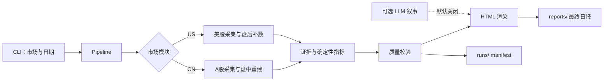

# Stock Report

[](LICENSE)
[](pyproject.toml)

一个面向 A 股和美股的确定性市场报告流水线：使用代码完成公开数据采集、指标计算、质量校验、证据留存和 HTML 渲染，而不是让一段大型 Prompt 控制全部流程。A 股同时支持盘中快报和正式收盘日报。

当前状态：

- A 股：已接入；
- 美股：已接入；
- 港股：配置、模块和模板已预留，采集器尚未实现；
- LLM：默认关闭，只保留可选叙事增强边界。

## 特性

- 多市场统一 CLI、配置和运行目录；
- 报告日自动识别，也支持指定历史日期；
- MA20/50/200、RSI14、量比和区间收益等确定性指标；
- 美股常规收盘与 ET 16:00–20:00 盘后数据分离；
- 历史美股回放自动避免使用当前涨跌榜，防止未来数据穿越；
- A 股 5 分钟行情、盘中阶段重建和时间戳事件对齐；
- A 股 `intraday` / `close` 双模式、独立缓存和质量门；
- 证据文件、来源信息、质量结果和运行 manifest 分层保存；
- HTML 未渲染占位符、报告/证据日期、历史长度等自动检查；
- Prompt 只约束表达，不参与行情计算和质量判断；
- 原有脚本命令保留为兼容入口。

## 工作流



## 环境要求

- Python 3.12 或更高版本；
- 推荐使用 [uv](https://docs.astral.sh/uv/)；
- 生成真实日报时需要访问公开市场数据端点；
- 项目核心流水线不依赖第三方 Python 运行库。

## 快速开始

### 使用 uv

```bash
git clone <your-repository-url>
cd stock
uv sync

uv run stock-report run --market cn --mode intraday
uv run stock-report run --market cn --mode close
uv run stock-report run --market us
```

### 不安装项目，直接从源码运行

```bash
PYTHONPATH=src python -m stock_report.cli run --market cn --mode intraday
PYTHONPATH=src python -m stock_report.cli run --market us
```

也可以使用兼容入口：

```bash
python scripts/generate_a_close_report.py
python scripts/generate_us_close_report.py
```

## CLI 使用

生成 A 股盘中快报或收盘日报：

```bash
stock-report run --market cn --mode intraday
stock-report run --market cn --mode intraday --refresh
stock-report run --market cn --mode close
stock-report run --market us
```

`--mode auto` 会在 A 股交易时段选择盘中模式，15:15 后选择收盘模式。盘中还可使用 `--as-of HH:MM` 指定截止时间。

A 股指定 `--as-of` 时，报价必须有同日报告时段内且不晚于截止时间的时间戳。
历史盘中回放必须同时指定 `--date` 和 `--as-of`；历史收盘报告默认截止到报告日 23:59:59。
不指定截止时间的当日实时运行，会在取数结束时确定实际截止时间，并将行情快照保存到
`runs/cn/<report_date>/snapshots/`，供后续回放使用。
板块资金流、涨跌停池等无法按时间回溯的数据，仅使用截止前已保存的同日快照；没有快照时显示“未取得”。
可用历史日K（不复权）或已完成的5分钟K重建价格，成交额、换手率和盘中量比不做推算。
缺少报告日K线时不会用其他交易日的行情代替；各字段的时间与来源保存在 `evidence.json`。

正式 A 股收盘报告要求上证指数、深证成指、沪深300、创业板指的有效收盘价、涨跌幅和同日时间戳，
并核验6个分钟线指数中至少5个具有完整的48根5分钟K线，且末根价格与收盘价偏差不超过0.2%。
核心检查失败时 `quality.passed=false`，CLI 返回退出码2；新闻事件不足只降级对应章节。
校验会读取实际 `minute_indices.json`，不会仅相信证据中声明的覆盖率或成功标志。

盘中分钟线按报告日、截止时间和交易时段的完整五分钟网格核验，重复、缺口、乱序和非网格时间不能用于凑足覆盖率。
事件反应只在完整30分钟窗口后计算；尚未完成的窗口保留在对齐结果中，标记“窗口待完成或数据不足”，不输出正式30分钟收益或同步评级。
非五分钟整点事件使用向下取整的价格窗口，并记录实际起止时间；不跨午休或收盘拼接窗口。

A 股跨市场参考从配置的 `runs_dir/us/` 中选择截至报告时间已经收盘的美股日线，
按美东交易日历处理周末、常规休市日和提前收盘日（[NYSE日历](https://www.nyse.com/trade/hours-calendars)）。
表格显示各资产实际数据日期；缺少最近交易日数据时，旧数据明确标记为“过期参考”，
不会冒充前一交易日数据。所用证据路径和日期同时保存到 `evidence.json` 的 `cross_market` 字段。

指定报告日：

```bash
stock-report run --market us --date 2026-07-31
```

只校验已有产物，不重新取数：

```bash
stock-report validate --market cn --date 2026-07-31
stock-report validate --market cn --date 2026-08-03 --mode intraday
stock-report validate --market us --date 2026-07-31
```

A 股盘中校验从指定日期的 `intraday_latest/manifest.json` 定位页面，不使用跨日期的 `A股盘中快报_latest.html`。
清单、证据和 HTML 元数据中的报告日与截止时间必须一致；清单或证据缺失会阻断校验。
旧盘中页面若没有日期和截止时间元数据，需要重新生成后再校验。

查看完整帮助：

```bash
stock-report --help
```

### 美股离线重渲染

渲染函数只消费已保存的证据和新闻，不会联网补数，也不依赖先前运行设置的全局日期：

```python
import json
from pathlib import Path
from stock_report.markets.us import render
from stock_report.news import load_news_events

run_dir = Path("runs/us/2026-07-31")
evidence = json.loads((run_dir / "market_data/evidence.json").read_text(encoding="utf-8"))
render(
    evidence,
    load_news_events(run_dir / "news"),
    template=Path("templates/us_close.html"),
    output=Path("reports/美股收盘日报_2026-07-31.html"),
)
```

证据必须包含 `report_date`；技术指标剔除晚于该日期的日K，旧交易日价格不能充当报告日行情。
生成时间、截止说明和日历优先使用证据中的 `generated_at`、`as_of`、`calendar_dates`。
市场方向要求 SPY、QQQ、DIA、IWM、RSP 五项有效收益；板块强弱比较要求至少6个板块ETF的有效报告日收益。
覆盖不足时不作方向或排名判断；收益相同不按配置顺序选出强弱，缺失收益不以零替代。

## 项目结构

```text
stock/
├── config.yaml                  # 路径、市场、模板和流水线配置
├── pyproject.toml
├── src/stock_report/
│   ├── cli.py                   # CLI 入口
│   ├── pipeline.py              # 统一编排
│   ├── models.py                # 运行与质量模型
│   ├── common.py                # 配置、日期、时区和交易日历
│   ├── metrics.py               # 公共技术指标
│   ├── quality.py               # 质量门
│   ├── analysis.py              # 确定性分析与排序
│   ├── news.py                  # 读取结构化新闻包
│   ├── llm.py                   # 可选叙事接口，默认关闭
│   ├── render.py                # 严格 HTML 渲染
│   └── markets/
│       ├── cn.py                # A 股完整流程
│       ├── us.py                # 美股完整流程
│       └── hk.py                # 港股预留入口
├── prompts/                     # 可选叙事约束
├── templates/                   # 各市场 HTML 模板
├── scripts/                     # 旧命令兼容入口
├── tests/                       # 离线测试
├── runs/                        # 分市场、分报告日的运行证据
└── reports/                     # 最终 HTML 日报
```

更完整的迁移背景和设计复盘见 [`项目从Prompt到代码流水线_复盘总结.md`](项目从Prompt到代码流水线_复盘总结.md)。

## 配置

配置集中在 [`config.yaml`](config.yaml)。为了保持零运行依赖，当前文件使用 JSON 兼容的 YAML 子集。

```json
{
  "pipeline": {
    "llm_enabled": false,
    "fail_on_unresolved_placeholders": true,
    "write_manifest": true
  },
  "markets": {
    "cn": {"timezone": "Asia/Shanghai"},
    "us": {"timezone": "America/New_York"},
    "hk": {"timezone": "Asia/Hong_Kong"}
  }
}
```

如果未来启用 LLM 叙事，可参考 [`.env.example`](.env.example) 设置环境变量。当前 `llm_enabled=false`，日报生成不需要 API Key。

## 数据与运行产物

每次运行按照市场和报告日保存证据：

```text
runs/cn/<report_date>/
├── intraday_latest/
│   ├── manifest.json
│   └── market_data/
└── close/
    ├── manifest.json
    └── market_data/
```

美股继续使用 `runs/us/<report_date>/`。新闻输入保持在 `runs/<market>/<report_date>/news/`，供两种模式共用。

A 股盘中流程还会生成：

- `minute_indices.json`：核心指数 5 分钟 K 线；
- `intraday_events.json`：带时间戳事件；
- `intraday_alignment.json`：事件与价格窗口对齐结果。

最终页面写入：

```text
reports/A股收盘日报_<date>_Asia-Shanghai.html
reports/A股盘中快报_<date>_<HHMM>.html
reports/A股盘中快报_latest.html
reports/美股收盘日报_<date>.html
```

`runs/` 与 `reports/` 是生成产物，默认不提交到 Git。

## 数据边界

当前市场模块使用的公开数据包括但不限于：

- A 股：腾讯行情与 K 线、东方财富行情与市场榜单、巨潮资讯公告、财联社时间戳快讯；
- 美股：Yahoo Chart、U.S. Treasury 收益率曲线、Nasdaq 财报日历；
- 新闻：读取预先生成的 `scan-market-news` 结构化事件包。

需要注意：

- `pipeline.py` 尚未自动执行 `scan-market-news`，新闻包需要预先生成；
- 港股采集器尚未实现；
- UZI 和 Public Equity Investing 尚未由主流水线自动调用；
- A 股官方宏观序列仍不完整；
- 免费公开端点可能限流、变更或暂时不可用；
- 历史报告的可复原程度取决于报告日缓存和数据源是否支持历史截面。

## 测试

测试默认离线运行，不会请求外部市场端点：

```bash
uv run python -m unittest discover -s tests -v
```

当前测试覆盖：

- 涨跌幅、MA、RSI 和量比；
- MA200 所需历史长度；
- 美股交易所休市日；
- HTML 未渲染占位符；
- 证据文件与报告日期；
- Pipeline 运行 manifest。

## Roadmap

- [ ] 将 `scan-market-news` 纳入主流水线；
- [ ] 增加 `--offline` 与 `--refresh` 模式；
- [ ] 统一保存原始响应、来源时间和内容哈希；
- [ ] 补充 A 股官方宏观序列；
- [ ] 实现港股行情、公告、南向资金和沽空流程；
- [ ] 扩展字段覆盖率与跨来源一致性质量门；
- [ ] 在确定性证据稳定后接入可选 LLM 叙事。

## 免责声明

本项目仅用于数据研究、软件开发和投资复盘，不构成投资建议、证券推荐、收益承诺或任何形式的受托管理服务。公开数据可能存在延迟、缺失、修订或接口错误；任何投资决策都应由使用者独立核验并自行承担风险。

## License

本项目采用 [MIT License](LICENSE)。
